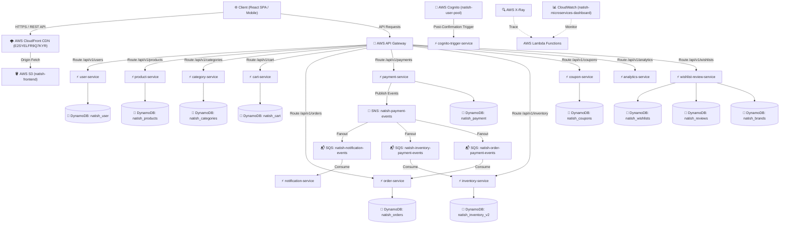

# 🛒 Natish E-Commerce Platform - Serverless Microservices Architecture

> A production-grade, event-driven, serverless e-commerce microservices platform built with **Node.js**, **Express.js**, **AWS Lambda**, **Amazon DynamoDB**, **Amazon Cognito**, **Amazon SNS & SQS**, **Terraform (IaC)**, and continuous integration via **GitHub Actions**, **SonarCloud**, and **Snyk**.

---

## 🌟 Executive Summary & Key Highlights

* **Architecture**: 12 decoupled, event-driven microservices running on AWS Lambda with Serverless Framework (`serverless-http`).
* **Database Layer**: High-performance NoSQL with 11 Amazon DynamoDB tables utilizing single & composite key schemas.
* **Authentication**: Centralized JWT authentication via AWS Cognito User Pool (`natish-user-pool`).
* **Event-Driven Messaging**: Asynchronous event publishing and consumption via Amazon SNS (`natish-payment-events`) and 5 dedicated SQS queues.
* **Infrastructure as Code**: Modular Terraform configuration (`/terraform`) managing DynamoDB, S3, CloudFront CDN with SPA error handling, Cognito, SNS/SQS, and CloudWatch.
* **Observability**: Distributed tracing with AWS X-Ray and unified metrics on CloudWatch Dashboard (`natish-microservices-dashboard`).
* **CI/CD & Security**: Automated GitHub Actions pipelines with path-filtered matrix testing, Snyk vulnerability scans, Jest unit testing, and SonarCloud Quality Gate compliance.

---

## 🏗️ System Architecture Diagram



---

## 🧩 Microservices Specification (12 Backend Services)

| Microservice | Primary Responsibility | DynamoDB Table Name | Partition Key (Hash) | Sort Key (Range) | Base API Route |
| :--- | :--- | :--- | :--- | :--- | :--- |
| **`user-service`** | Profile registration, user settings | `natish_user` | `userId` (S) | — | `/api/v1/users` |
| **`product-service`** | Product catalog management | `natish_products` | `productId` (S) | — | `/api/v1/products` |
| **`category-service`** | Product category taxonomy | `natish_categories` | `categoryId` (S) | — | `/api/v1/categories` |
| **`cart-service`** | Cart management & subtotal calculations | `natish_cart` | `userId` (S) | — | `/api/v1/cart` |
| **`order-service`** | Order placement & fulfillment tracking | `natish_orders` | `orderid` (S) | — | `/api/v1/orders` |
| **`payment-service`** | Payment transaction processing | `natish_payment` | `paymentid` (S) | — | `/api/v1/payments` |
| **`inventory-service`**| Stock reservation & inventory updates | `natish_inventory_v2` | `productId` (S) | — | `/api/v1/inventory` |
| **`coupon-service`** | Discount codes & validation | `natish_coupons` | `couponCode` (S) | — | `/api/v1/coupons` |
| **`analytics-service`** | Metrics tracking & business reporting | — | — | — | `/api/v1/analytics` |
| **`cognito-trigger-service`**| User registration lifecycle hooks | — | — | — | Cognito Triggers |
| **`notification-service`**| Customer notifications & alerts | — | — | — | SQS Consumer |
| **`wishlist-review-service`**| Customer wishlists, reviews, and brands | `natish_wishlists`<br>`natish_reviews`<br>`natish_brands` | `userId` (S)<br>`reviewId` (S)<br>`brandId` (S) | `productId` (S)<br>—<br>— | `/api/v1/wishlists`<br>`/api/v1/reviews`<br>`/api/v1/brands` |

---

## 📬 Event-Driven Architecture (SNS & SQS)

The application utilizes an asynchronous pub/sub model to decouple payment processing from notification delivery, inventory allocation, and order updates:

* **SNS Topic**: `natish-payment-events`
  * Published by `payment-service` upon transaction execution.
* **SQS Queues (5 Production Standard Queues)**:
  1. `natish-inventory-payment-events`: Adjusts stock level upon payment confirmation.
  2. `natish-inventory-product-created`: Initializes stock entry for newly created products.
  3. `natish-notification-events`: Subscribed to SNS topic for dispatching customer receipt emails.
  4. `natish-order-payment-events`: Updates order status from `PENDING` to `PAID`.
  5. `natish-product-category-events`: Synchronizes catalog entries when category taxonomy changes.

---

## 🛠️ Infrastructure as Code (Terraform)

All AWS cloud infrastructure is declaratively managed under `/terraform`:

```text
/terraform
├── main.tf                 # Root Terraform orchestrator linking modules
├── variables.tf            # Global variables (aws_region, project_name = "natish")
├── outputs.tf              # Exported CloudFront URL, S3 Bucket, Cognito IDs, SQS Queues
├── terraform.tfvars        # Deployment configuration parameters
└── modules/
    ├── dynamodb/           # 11 DynamoDB production table resources
    ├── s3_frontend/        # Static website hosting bucket (natish-frontend)
    ├── cloudfront/         # CloudFront CDN with SPA 403/404 index.html redirects
    ├── cognito/            # User pool (natish-user-pool) and App Client
    ├── messaging/          # SNS payment topic & 5 SQS event queues
    └── cloudwatch/         # Unified dashboard (natish-microservices-dashboard)
```

### Targeted Deployment Command:
To deploy or update individual modules without altering other resources:
```bash
cd terraform
terraform apply -target="module.cloudwatch" -auto-approve
```

---

## 🔒 Security, Compliance & Code Quality

* **Authentication & Authorization**: Integrated AWS Cognito JWT token verification (`aws-jwt-verify`) in Express middleware (`authMiddleware.js`).
* **Secure CORS**: Dynamic domain validation callback supporting local dev and CloudFront origins.
* **Cryptographic Security**: Standardized node-native secure imports (`node:crypto`, `node:http`, `node:https`) eliminating pseudorandom vulnerabilities (`crypto.randomInt`).
* **Snyk Security Auditing**: Automated SAST security testing integrated into CI pipelines for vulnerability reporting.
* **SonarCloud Quality Gate**: Pre-configured Quality Profile and test boundaries (`sonar-project.properties`) achieving green **PASSED** Quality Gate rating.

---

## 📊 Observability & Monitoring

* **AWS CloudWatch Dashboard**: **`natish-microservices-dashboard`**
  * Visualizes **Invocations**, **Errors**, **Duration (Latency)**, and **Throttles** across all 12 microservice Lambda functions in 5-minute aggregation metrics.
* **AWS X-Ray Tracing**: Full distributed request tracing enabled via `AWSXRay.express.openSegment()` and instrumented AWS SDK v3 clients (`AWSXRay.captureAWSv3Client`).

---

## 🚀 CI/CD Pipelines (GitHub Actions)

1. **Microservices CI (`.github/workflows/ci.yml`)**:
   * **Path Filtering**: Detects modified microservice files (`dorny/paths-filter@v3`) and executes matrix tests **only on modified services** for fast, incremental feedback.
   * **Validation**: Executes ESLint, Prettier, Jest unit tests with coverage, Snyk vulnerability scans, and SonarQube code quality analysis.
2. **Microservices CD (`.github/workflows/cd.yml`)**:
   * Automatically deploys updated microservices to AWS Lambda via Serverless Framework upon passing CI validation on `master`.

---

## 💻 Local Setup & Testing Commands

### Prerequisites
* Node.js v20+
* Terraform v1.5+
* AWS CLI configured (`aws sso login`)

### Running Microservices Locally
```bash
# Navigate to a service directory
cd e-com_backend/user-service

# Install dependencies
npm install

# Run unit tests & coverage
npm run test:coverage

# Start service locally
npm run dev
```

---

### 👨‍💻 Project Maintainer
* **Developer**: Natish (`natishg-1632006`)
* **Repository**: [https://github.com/natishg-1632006/E-commerce](https://github.com/natishg-1632006/E-commerce)
